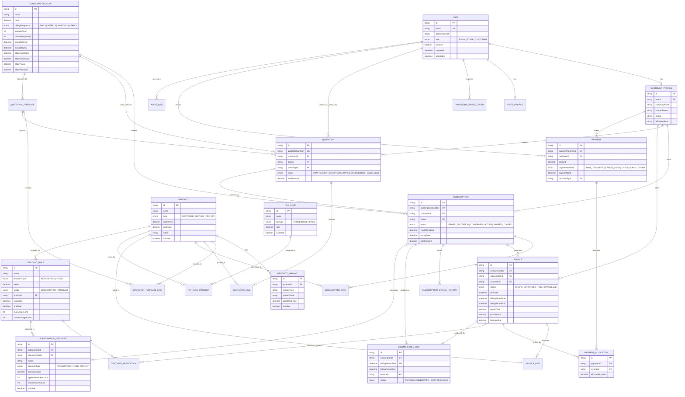

# Brightloop Subscription Management System — Entity Relationship Diagram

```mermaid
erDiagram
    USER ||--o| CUSTOMER_PROFILE : has
    USER ||--o| STAFF_PROFILE : has
    USER ||--o{ PASSWORD_RESET_TOKEN : requests
    USER ||--o{ QUOTATION : creates_as_sales_rep
    USER ||--o{ PAYMENT : records
    USER ||--o{ AUDIT_LOG : generates

    CUSTOMER_PROFILE ||--o{ SUBSCRIPTION : owns
    CUSTOMER_PROFILE ||--o{ QUOTATION : receives
    CUSTOMER_PROFILE ||--o{ INVOICE : billed
    CUSTOMER_PROFILE ||--o{ PAYMENT : makes

    PRODUCT ||--o{ PRODUCT_VARIANT : has
    PRODUCT ||--o{ QUOTATION_TEMPLATE_LINE : included_in
    PRODUCT ||--o{ QUOTATION_LINE : quoted_in
    PRODUCT ||--o{ SUBSCRIPTION_LINE : subscribed_in
    PRODUCT ||--o{ INVOICE_LINE : billed_in
    PRODUCT ||--o{ TAX_RULE_PRODUCT : taxed_by
    PRODUCT ||--o{ DISCOUNT_RULE : targeted_by

    SUBSCRIPTION_PLAN ||--o{ SUBSCRIPTION : defines
    SUBSCRIPTION_PLAN ||--o{ QUOTATION : plan_selected
    SUBSCRIPTION_PLAN ||--o{ QUOTATION_TEMPLATE : blueprint_for

    QUOTATION_TEMPLATE ||--o{ QUOTATION_TEMPLATE_LINE : contains
    QUOTATION_TEMPLATE ||--o{ QUOTATION : spawns

    QUOTATION ||--o{ QUOTATION_LINE : itemizes
    QUOTATION ||--o| SUBSCRIPTION : converts_to

    SUBSCRIPTION ||--o{ SUBSCRIPTION_LINE : itemizes
    SUBSCRIPTION ||--o{ INVOICE : generates
    SUBSCRIPTION ||--o{ SUBSCRIPTION_STATUS_HISTORY : tracks
    SUBSCRIPTION ||--o{ BILLING_CYCLE_LOG : audited_by
    SUBSCRIPTION ||--o{ SUBSCRIPTION_DISCOUNT : schedules

    INVOICE ||--o{ INVOICE_LINE : itemizes
    INVOICE ||--o{ PAYMENT_ALLOCATION : settled_by
    INVOICE ||--o{ DISCOUNT_APPLICATION : discounts_applied
    INVOICE ||--o| BILLING_CYCLE_LOG : produced_by

    PAYMENT ||--o{ PAYMENT_ALLOCATION : allocates

    DISCOUNT_RULE ||--o{ DISCOUNT_APPLICATION : applied_as
    DISCOUNT_RULE ||--o{ SUBSCRIPTION_DISCOUNT : attached_to
    TAX_RULE ||--o{ TAX_RULE_PRODUCT : assigned_to

    USER {
        string id PK
        string email UK
        string passwordHash
        enum role "ADMIN | STAFF | CUSTOMER"
        boolean isActive
        datetime createdAt
        datetime updatedAt
    }

    CUSTOMER_PROFILE {
        string id PK
        string userId FK
        string companyName
        string contactName
        string phone
        string billingAddress
    }

    PRODUCT {
        string id PK
        string name
        enum type "SOFTWARE | SERVICE | ADD_ON"
        decimal salesPrice
        decimal costPrice
        string notes
        boolean isActive
    }

    PRODUCT_VARIANT {
        string id PK
        string productId FK
        string variantType
        string variantValue
        decimal additionalPrice
        boolean isActive
    }

    SUBSCRIPTION_PLAN {
        string id PK
        string name
        decimal price
        enum billingFrequency "DAILY | WEEKLY | MONTHLY | YEARLY"
        int intervalCount
        int minimumQuantity
        datetime availableFrom
        datetime availableUntil
        boolean allowAutoClose
        boolean allowEarlyClose
        boolean allowPause
        boolean allowRenewal
    }

    QUOTATION {
        string id PK
        string quotationNumber UK
        string customerId FK
        string planId FK
        string salesRepId FK
        enum status "DRAFT | SENT | ACCEPTED | EXPIRED | CONVERTED | CANCELLED"
        decimal totalAmount
    }

    SUBSCRIPTION {
        string id PK
        string subscriptionNumber UK
        string customerId FK
        string planId FK
        enum status "DRAFT | QUOTATION | CONFIRMED | ACTIVE | PAUSED | CLOSED"
        datetime nextBillingDate
        datetime expiryDate
        decimal totalAmount
    }

    INVOICE {
        string id PK
        string invoiceNumber UK
        string subscriptionId FK
        string customerId FK
        enum status "DRAFT | CONFIRMED | PAID | CANCELLED"
        datetime dueDate
        datetime billingPeriodStart
        datetime billingPeriodEnd
        decimal grandTotal
        decimal paidAmount
        decimal balanceDue
    }

    BILLING_CYCLE_LOG {
        string id PK
        string subscriptionId FK
        datetime billingPeriodStart UK
        datetime billingPeriodEnd
        string invoiceId FK
        enum status "PENDING | GENERATED | SKIPPED | FAILED"
    }

    SUBSCRIPTION_DISCOUNT {
        string id PK
        string subscriptionId FK
        string discountRuleId FK
        string name
        enum discountType "PERCENTAGE | FIXED_AMOUNT"
        decimal discountValue
        int appliedInvoicesCount
        int maxInvoicesCount
        boolean isActive
    }

    PAYMENT {
        string id PK
        string paymentReference UK
        string customerId FK
        decimal amount
        enum paymentMethod "BANK_TRANSFER | CREDIT_CARD | CHECK | CASH | OTHER"
        datetime paymentDate
        string recordedById FK
    }

    PAYMENT_ALLOCATION {
        string id PK
        string paymentId FK
        string invoiceId FK
        decimal allocatedAmount
    }

    DISCOUNT_RULE {
        string id PK
        string name
        enum discountType "PERCENTAGE | FIXED"
        decimal value
        enum scope "SUBSCRIPTION | PRODUCT"
        string productId FK
        datetime startDate
        datetime endDate
        int maxUsageLimit
        int currentUsageCount
    }

    TAX_RULE {
        string id PK
        string name
        enum taxType "PERCENTAGE | FIXED"
        decimal rate
        boolean isDefault
    }
```
